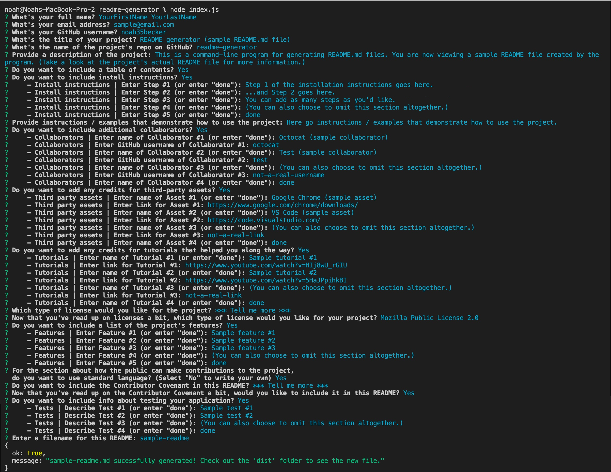

# README generator (sample README.md file)

    

## Repo
[https://github.com/noah35becker/readme-generator](https://github.com/noah35becker/readme-generator)

## Description
This is a command-line program for generating README.md files. You are now viewing a sample README file created by the program. (Take a look at the project's actual README file for more information.)

<i><b>
## Table of contents
- [Installation](#installation)
- [Usage](#usage)
- [Credits](#credits)
- [License](#license)

- [Contributing](#contributing)

- [Questions](#questions)
- [Screenshot of terminal input*](#screenshot-of-terminal-input)
</i></b>

## Installation
1. Step 1 of the installation instructions goes here.
2. ...and Step 2 goes here.
3. You can add as many steps as you'd like.
4. (You can also choose to omit this section altogether.)

## Usage
Here go instructions / examples that demonstrate how to use the project.

## Credits

### Collaborators
- YourFirstName YourLastName ([GitHub](https://github.com/noah35becker))
- Octocat (sample collaborator) ([GitHub](https://github.com/octocat))
- Test (sample collaborator) ([GitHub](https://github.com/test))
- (You can also choose to omit this section altogether.) ([GitHub](https://github.com/not-a-real-username))

### Third-party assets
- [Google Chrome (sample asset)](https://www.google.com/chrome/downloads/)
- [VS Code (sample asset)](https://code.visualstudio.com/)
- [(You can also choose to omit this section altogether.)](not-a-real-link)

### Tutorials
- [Sample tutorial #1](https://www.youtube.com/watch?v=HIj8wU_rGIU)
- [Sample tutorial #2](https://www.youtube.com/watch?v=5HaJPpihkBI)
- [(You can also choose to omit this section altogether.)](not-a-real-link)

## License

Learn more about this license [here](https://choosealicense.com/licenses/mpl-2.0).

## Features
- Sample feature #1
- Sample feature #2
- Sample feature #3
- (You can also choose to omit this section altogether.)

## Contributing
Feel free to fork this project's [repo](https://github.com/noah35becker/readme-generator), contribute code, and submit pull requests [here](https://github.com/noah35becker/readme-generator/pulls)!

Contributors to this project must follow all guidelines set forth by the [Contributor Covenant](https://www.contributor-covenant.org/version/2/1/code_of_conduct/).

## Tests
- Sample test #1
- Sample test #2
- (You can also choose to omit this section altogether.)

## Questions
You can find me on GitHub [here](https://github.com/noah35becker).

If you have any questions, I'd be glad to hear from you—contact me at [sample@email.com](mailto:sample@email.com).

## Screenshot of terminal input*
Below is a screenshot of the terminal input used to create this sample README file.

<i>*This section, as well as its entry in the [Table of contents](#table-of-contents), was added manually to this file after running the generator program.</i>

